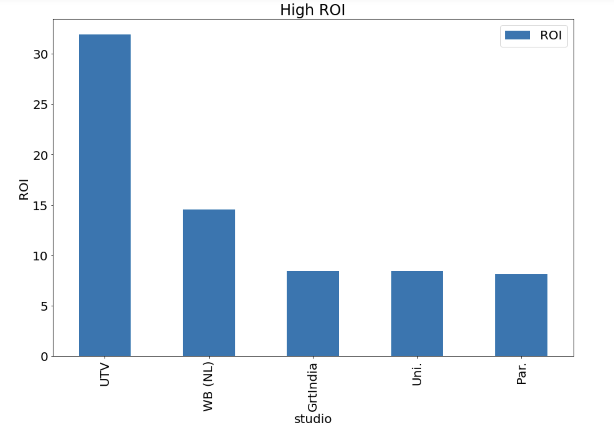
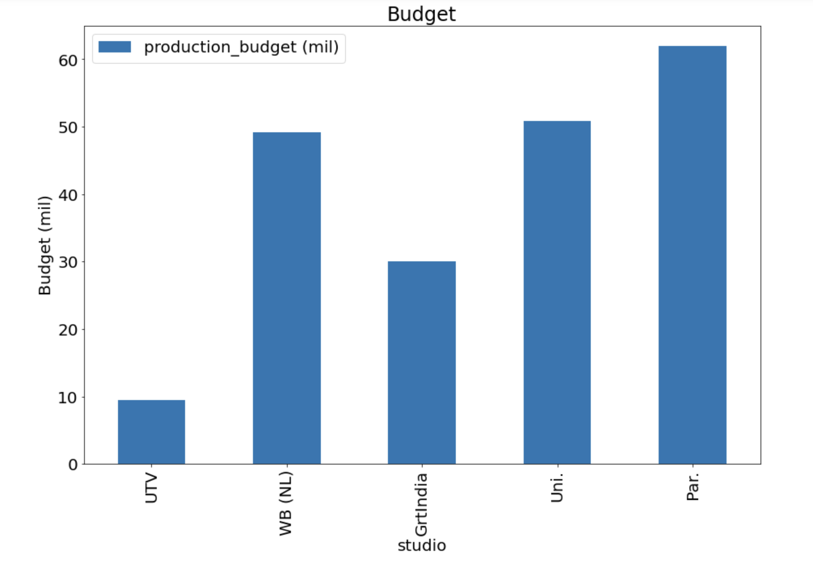

# Microsoft studio needs movie analysis,

**Authors:** Yeonjae Zhang, Caleb
***
## Overview

This analysis is made for suggesting mircosoft studio the goals and business directions. With numbers and vote data, I will figure out which movies were successful and recommand business directions from historical data.

## Business Problem

Microsoft is willing to create original video content and they want to do successful business.

Find partner studio
Budget recommendation
Find high gross genres

## Data

Box Office Mojo has the longest running dataset of movie gross for money from the popular movies in world-wide. And IMDB has the largest dataset of the popularity. The numbers has the movie numbers data. The data files will provide title, domestic gross, foreign gross, genres, and budgets.

### Methods

This projects uses the descriptive analysis with historical movie data. This provides useful overview of suggestions.

## Results"
There are Top 5 studios that made money more than 100 mil each movies. Introduce 5 studios [UTV, WB, Gitindia, Uni., Par.]

UTV : 10 mil, WB : 50 mil, Gitindia : 30 mil, Uni. : 50 mil, Par. : 60 mil

This analysis shows the 3 genres that made money the best. I recommend the combination of Animation, Adventure and Sci-Fi. This combination will lead microsoft studio to success.

## Conclusions
This analysis leads to three recommendations for movie studio business:

* **This analysis suggests that microsoft studio make a movie with partnership** There are Top 5 studios that made money more than 100 mil each movies. Introduce 5 studios [UTV, WB, Gitindia, Uni., Par.]
* **This analysis suggests budgets with the introduced partner studios.**  UTV : 10 mil, WB : 50 mil, Gitindia : 30 mil, Uni. : 50 mil, Par. : 60 mil
* **Recommend successful movie genre combination.** This analysis shows the 3 genres that made money the best. I recommend the combination of Animation, Adventure and Sci-Fi. This combination will lead microsoft studio to success.
